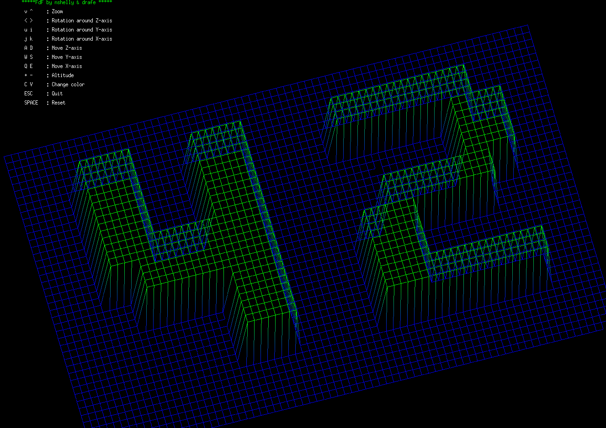

# FdF - Fil de Fer




## Description

**FdF** (Fil de Fer, French for "wireframe") is a 42 School project that creates a 3D wireframe representation of a landscape from a data file. The program reads a map file containing height values and renders them as a 3D wireframe model that can be rotated, zoomed, and colored interactively.

### Features

- 🎨 **3D Wireframe Visualization** - Transform 2D height maps into 3D wireframe models
- 🔄 **Interactive Controls** - Rotate, zoom, and move the 3D model in real-time
- 🌈 **Color Modes** - Multiple color schemes and customizable color palettes
- 📐 **Isometric Projection** - Beautiful isometric view of terrain data
- 🎮 **Keyboard Controls** - Full keyboard support for all transformations

## Dependencies

This project uses:

- **MiniLibX** - A simple X-Window programming API for students
  - Source: [42Paris/minilibx-linux](https://github.com/42paris/minilibx-linux)
  - MiniLibX is a lightweight graphics library designed for educational purposes
  - Supports X11 on Linux systems

### System Requirements

**For Linux:**
```bash
sudo apt-get install gcc make xorg libxext-dev libbsd-dev
```

## Quick Start

### 1. Clone the repository
```bash
git clone <repository-url>
cd fdf
```

### 2. Build the project
```bash
make
```

The Makefile will automatically:
- Build the `libft` library
- Configure and build MiniLibX
- Compile all source files
- Link everything into the `fdf` executable

### 3. Run FdF
```bash
./fdf maps/42.fdf
```

Or try other maps:
```bash
./fdf maps/mars.fdf
./fdf maps/42_big.fdf
```

## Controls

| Key | Action |
|-----|--------|
| **Arrow Keys** | Rotate around Z-axis (Left/Right), Zoom (Up/Down) |
| **W / S** | Move along Y-axis |
| **A / D** | Move along X-axis |
| **Q / E** | Move along Z-axis |
| **U / I** | Rotate around Y-axis |
| **J / K** | Rotate around X-axis |
| **+ / =** | Increase altitude |
| **-** | Decrease altitude |
| **C** | Change color mode |
| **V** | Cycle through color styles |
| **SPACE** | Reset to initial view |
| **ESC** | Quit program |

## Map File Format

FdF reads map files with the following format:
- Each line represents a row of the map
- Space-separated integers represent height values
- `0` represents the base level
- Positive values represent elevation
- Negative values represent depressions

Example (`maps/42.fdf`):
```
0  0  0  0  0  0  0  0  0  0  0  0  0  0  0  0  0  0  0
0  0 10 10  0  0 10 10  0  0  0 10 10 10 10 10  0  0  0
0  0 10 10  0  0 10 10  0  0  0  0  0  0  0 10 10  0  0
...
```

## Project Structure

```
fdf/
├── src/           # Source files
│   ├── main.c     # Main program entry point
│   ├── fdf_draw.c # Drawing functions
│   ├── fdf_keys.c # Keyboard input handling
│   ├── fdf_colors.c # Color management
│   └── ...
├── maps/          # Map files (.fdf format)
├── libft/         # Custom C library
├── mlx_linux/     # MiniLibX library
├── fdf.h          # Header file
└── Makefile       # Build configuration
```

## Authors

- **drafe** - [@drafe](https://github.com/drafe)
- **nshelly** - [@nshelly](https://github.com/nshelly)

## License

This project is part of the 42 School curriculum. Please refer to the LICENSE file for details.

## Acknowledgments

- **MiniLibX** by 42Paris - [GitHub Repository](https://github.com/42paris/minilibx-linux)
- **42 School** for the project specification

---

Made with ❤️ at 42 School (School 21 by Sber, Moscow)
